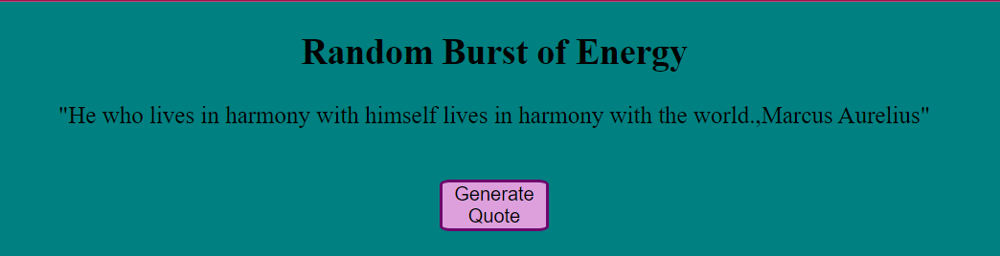

# Random Burst of Energy

Project that involves fetching and displaying quotes each time the user interactions with the application. It allowed me to practice working with APIs and manipulating the DOM using JavaScript.

## Table of contents

- [Screenshot](#screenshot)
- [Tools](#built-with)
- [Links](#links)
- [Author](#author)

## Screenshot

## Built with

- HTML
- CSS
- JavaScript
- API

## Getting Started

**How to use**

Open with IDE of choice, right click on HTML and open in preferred browser. Click "Generate Quote" button and be amazed.

## Links

API: [Quotable.io](https://api.quotable.io/random)

## Author

- LinkedIn - [@avion-cobb](https://www.linkedin.com/in/avion-cobb/)
- Twitter - [@Blvck_Lotus003](https://twitter.com/Blvck_Lotus003)